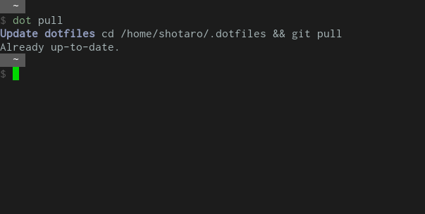
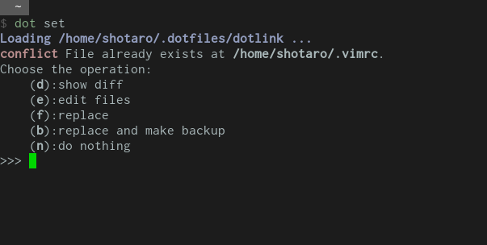
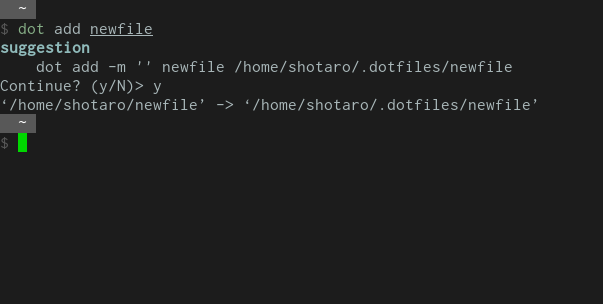
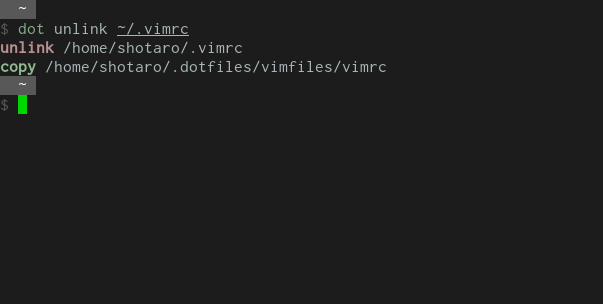

[日本語](./README_ja.md)

# dot v1.2.2

dotfiles management framework with shell (bash, zsh)

## Description

This script makes it easy to manage your dotfiles.

Script is written in shell script, and very configurable.

You can use it for multi-machines usage, setup for new machine, daily watering to your dotfiles repository, etc...

## Usage

Configuration file is in '[dotrc](./examples/dotrc)'.
Link relation table is in '[dotlink](./examples/dotlink)'.

**subcommand**

| subcommand            | description                                                                                                   | option or arguments                                                   |
| ---                   | ---                                                                                                           | ---                                                                   |
| [pull](#dot_pull)     | Pull from dotfile repository (by git)                                                                         | `[--self]`                                                            |
| [list](#dot_list)     | Show the list which files will be managed by dot.                                                             |                                                                       |
| [check](#dot_check)   | Check the files are correctly linked to the right places.                                                     |                                                                       |
| [cd](#dot_cd)         | Change directory to 'dotdir'.                                                                                 |                                                                       |
| [set](#dot_set)       | Set symbolic links configured in `dotlink`.                                                                   | `[-i|--ignore][-f|--force][-b|--backup][-v|--verbose]`                |
| [update](#dot_update) | Combined command of 'pull' and 'set' commands.                                                                | `[-i|--ignore][-f|--force][-b|--backup][-v|--verbose]`                |
| [add](#dot_add)       | Move the new file to the dotfile dir, make the link, and add the link information to `dotlink` automatically. | `some_file [$DOT_DIR/path/to/the/file]` or `link1 [link2 link3 ... ]` |
| [edit](#dot_edit)     | Edit `dotlink`                                                                                                |                                                                       |
| [config](#dot_config) | Edit configuration file 'dotrc'                                                                               |                                                                       |
| [unlink](#dot_unlink) | Unlink the selected symbolic links and copy its original files from the dotfile directory.                    | `link1 [link2 link3 ... ]`                                            |
| [clear](#dot_clear)   | Remove the *all* symbolic link written in the dotlink file `dotlink`.                                         |                                                                       |
| [clone](#dot_clone)   | Clone dotfile repository on your computer with git.                                                           | `[/directory/to/clone/]`                                              |

**option**

|option       |description                            |arguments|
|---          |---                                    |---      |
| -h, --help  |Show help message.                     |         |
| -c, --config|Specify the configuration file to load.| `dotrc` |

### <a name="dot_pull">dot pull</a>

Pull from remote dotfile repository (by git)



With `--self` option, then git pull for `dot` and it will be up to date.

```
dot pull --self
```

### <a name="dot_list">dot list</a>

Show the list which files be managed by dot.

### <a name="dot_check">dot check</a>

Check the files are correctly linked to the right places.


* "✘" means this file is not managed by dot now but is written in `dotlink`.
* "✔" means this file is managed by dot now.

### <a name="dot_cd">dot cd</a>

Change directory to `dotdir`.

### <a name="dot_set">dot set</a>

Set symbolic links configured in `dotlink`.

If you have your file already, you can choose the operation interactively:

* show diff
* edit file
* replace
* replace and make backup
* do nothing

With option `-i` or `--ignore`, this script ignores conflict files and links.

With option `-f` or `--force`, this script ignores all conflicts and force make symbolic links.

With option `-b` or `--backup`, this script ignores all conflicts and force make symbolic links but make it original backup named `file.bak`.

With `-v` or `--verbose`, this script shows verbose messages.



### <a name="dot_update">dot update</a>

Combined command of 'pull' and 'set' commands.

Same option of `set` command.

### <a name="dot_add">dot add</a>

Move the new file to the dotfile dir, make the link, and add the link information to `dotlink` automatically.



### <a name="dot_edit">dot edit</a>

Edit `dotlink`

```
dot edit
```

### <a name="dot_config">dot config</a>

Edit configuration file 'dotrc'

```
dot config
```

### <a name="dot_unlink">dot unlink</a>

Unlink the selected symbolic links and copy its original files from the dotfile directory.



### <a name="dot_clear">dot clear</a>

Remove the *all* symbolic link written in the dotlink file `dotlink`.

```
dot clear
```

### <a name="dot_clone">dot clone</a>

Clone dotfile repository on your computer with git.

```
dot clone [<dir_to_clone>]
```

## Use case

### Multi-machine configuration

You can add `dotrc.local` and `dotlink.local` on each computers and don't have to divide dotfiles repository.

Share or don't share the configuration what you want.

`dot pull` provides you fresh dotfiles anywhere.

### New machine setup

If you have your own dotfiles already and managed with `dot`, just:

* Install git and dot.
* Set environment variables in your terminal:  
```
DOT_REPO="https://github.com/username/dotfiles.git"
DOT_DIR="$HOME/.dotfiles"
```
* And just run  
```
dot clone && dot set
```

### For daily use

If you want to add your new configuration file to your dotfiles repository, just run

```
dot add newfile
```

Then the script asks you like:

```
[suggestion]
    dot add -m '' newfile /home/username/.dotfiles/newfile
Continue? [y/N]> 
```

Type `y` and `Enter`, then move `newfile` to `/home/username/.dotfiles/newfile`
and make symbolic link to `newfile` and this link information is written in `dotlink`.

Other things you should do is `git commit` and `git push` to your repository.
(Or if you use Dropbox or so, you can skip these steps.)

In order to add link-relation-table already exists, just

```
dot add <link1> <link2> <link2> <link3> ...
```

## Install

### Requirements

* bash
* git

### Install manually

Clone this repository on your computer and source from your `bashrc` or `zshrc`.

**COMMAND LINE**

```
git clone https://github.com/ssh0/dot $HOME/.zsh/dot
```

**in {bash,zsh}rc**

```
export DOT_REPO="https://github.com/username/dotfiles.git"
export DOT_DIR="$HOME/.dotfiles"
source $HOME/.zsh/dot/dot.sh
```

### With plugin manager

If you use some zsh plugin manager (ex. [zplug](https://github.com/b4b4r07/zplug),
[zgen](https://github.com/tarjoilija/zgen),
[antigen](https://github.com/zsh-users/antigen), etc.), load from `zshrc` like:

```
zplug "ssh0/dot"
```

```
zgen load ssh0/dot
```

```
antigen bundle ssh0/dot
```

## Configuration

First, you should set the dotfiles repository to manage and the dotfiles directory.

In `~/.zshrc`,

```
export DOT_REPO="https://github.com/username/dotfiles.git"
export DOT_DIR="$HOME/.dotfiles"
```

### Change the command name

The name "dot" is too common and may be used in other script or application.

Or, you may want to change it more short name.

You can set the alias for `dot` of cource, but you can also disable the name `dot` for this script and give a different name you want by writting like below in your `bashrc` or `zshrc`:

```
export DOT_COMMAND=DOOOOOOOOOOOOT
```

then the command `dot` is no longer the name of this script.

(You can call the main function by `dot_main` of cource.)

### Edit your configuratoin file

```
dot config 
```

will edit `$HOME/.config/dot/dotrc`(if it doesn't exist, copy the template one).

### Specify the configuration file to load

With `-c, --config` option, you can execute dot command specifing the configuration file to load.

**Usage example**

* If you divide some configuration files for each application to different repositories
* If you borrow from other people's dotfiles
* etc.

If you want to borrow other person's dotfiles repository, create a configuration file like below.
(It is useful that this file will be managed in *your* dotfiles.)

filename: `~/.config/dot/dotrc-someone`

```bash
clone_repository=https://github.com/someone/dotfiles.git
dotdir=$HOME/.dotfiles-someone
dotlink=$HOME/.config/dot/dotlink-someone
linkfiles=("$HOME/.config/dot/dotlink-someone")
```

It is useful to define a function in your `bashrc` or `zshrc` like below in order to run the `dot` command with loading the config file above.

```bash
alias dot-someone="dot -c $HOME/.config/dot/dotrc-someone"
```

Then, you can use `dot-someone` command in the same way.

Run `dot-someone edit` to write the link relations and execute `dot-someone set` to deploy symbolic links.

It's also helpful that you define a function to run `dot` command loading each dot-config files (especially `set` command or `pull`) like below.

In your `bashrc` or `zshrc`:

```bash
dotconfigs=("file1" "file2" "file3")

dotall() {
  for dotconfig in ${dotconfigs[@]}; do
    dot -c "${dotconfig}" "$@"
  done
}

```

In Zsh, to enable completion add the line:

```zsh
compdef dotall=dot_main
```

### Edit your dotlink manually

```
dot edit
```

will open `dotlink` and you can edit this file manually.

**EXAMPLE**

`dotlink`

```

# script ignore commented out line

# and empty line

# Format:
# <dotfile>,<linkto>
#
# the script automatically add root directory to the file path.
# So, you should write like below:
myvimrc,.vimrc

# Then the script will make the symbolic link from `$DOT_DIR/myvimrc` to `$HOME/.vimrc`.

# The path start from slash "/" is correctly understood by the script.
# And you can use environment variables in it.
# It is useful when the file contains some private information and
# you wouldn't upload it to your dotfiles repository.
$HOME/Dropbox/briefcase/netrc,.netrc

```

My `dotlink` is [in my dotfiles repository](https://github.com/ssh0/dotfiles/blob/master/dotlink).

### [optional] Copy local settings

```
cp ~/.zsh/dot/examples/dotrc ~/.config/dot/dotrc.local
```

and source this file from your configuration file `dotrc`:

```
dotbundle "$HOME/.config/dot/dotrc.local"
```

## TODO

* test in other OS (I use some Ubuntu 14.04 machines and only tested in there)

## LICENSE

This project is under [MIT](./LICENSE) license.

## Contact

If you improve this project, find bugs or have a question, feel free to contact me.

* [ssh0(Shotaro Fujimoto) - GitHub](https://github.com/ssh0)

