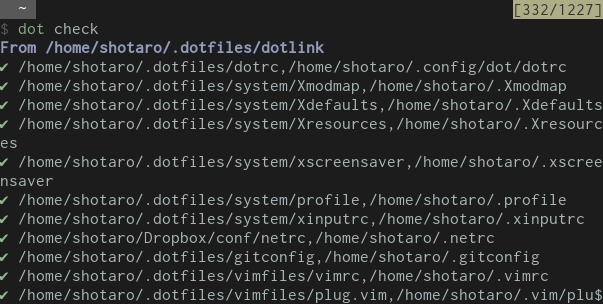

[English](./README.md)

# dot v1.2.2

`dot`はシェルスクリプトで書かれたdotfiles管理フレームワークです。

## 説明

このスクリプトを使うとdotfilesの管理が簡単になります。

日常的に複数マシンを使う人，新しいPCのセットアップするとき，毎日dotfilesでcontributionに草を生やし続けている人におすすめです。

## 使い方

ユーザーの設定ファイルは'[dotrc](./examples/dotrc)'。
シンボリックリンクの対応表は'[dotlink](./examples/dotlink)'に書きます。

**サブコマンド**

| サブコマンド名        | 説明                                                                                | オプション or 引数                                                    |
| ---                   | ---                                                                                 | ---                                                                   |
| [pull](#dot_pull)     | dotfiesをpullしてくる(by git).                                                      | `[--self]`                                                            |
| [list](#dot_list)     | `dot`で管理するファイルを一覧を表示                                                 |                                                                       |
| [check](#dot_check)   | ファイルにリンクが張られているかどうかチェックする                                  |                                                                       |
| [cd](#dot_cd)         | ディレクトリ`dotdir`に移動                                                          |                                                                       |
| [set](#dot_set)       | `dotlink`に書かれたシンボリックリンクを貼る                                         | `[-i|--ignore][-f|--force][-b|--backup][-v|--verbose]`                |
| [update](#dot_update) | 'pull'コマンドと'set'コマンドの組み合わせ                                           | `[-i|--ignore][-f|--force][-b|--backup][-v|--verbose]`                |
| [add](#dot_add)       | 新たなファイルをdotfilesに追加，シンボリックリンクを貼り，対応関係を`dotlink`に追記 | `some_file [$DOT_DIR/path/to/the/file]` or `link1 [link2 link3 ... ]` |
| [edit](#dot_edit)     | `dotlink`を手動で編集                                                               |                                                                       |
| [config](#dot_config) | 設定ファイル`dotrc`を編集                                                           |                                                                       |
| [unlink](#dot_unlink) | 選択したシンボリックリンクをunlinkし，dotfilesから元ファイルをコピー                | `link1 [link2 link3 ... ]`                                            |
| [clear](#dot_clear)   | `dotlink`ファイルに記載された**すべての**シンボリックリンクをunlink                 |                                                                       |
| [clone](#dot_clone)   | gitコマンドを使ってdotfilesを自分のPCにクローン                                     | `[/directory/to/clone/]`                                              |

**オプション**

|オプション   |説明                      |引数     |
|---          |---                       |---      |
| -h, --help  |ヘルプを表示              |         |
| -c, --config|読み込む設定ファイルを指定| `dotrc` |

### <a name="dot_pull">dot pull</a>

dotfiesをpullしてくる(by git)。


`--self`オプションをつけると，`dot`自身を最新の状態に更新します。

```
dot pull --self
```

### <a name="dot_list">dot list</a>

`dot`で管理するファイルを一覧表示する。

### <a name="dot_check">dot check</a>

ファイルにリンクが張られているかどうかチェックする。



* "✘" は現在dotで管理されていないが`dotlink`に対応が書かれているものを表す。
* "✔" はdotで管理されているものを表す。

### <a name="dot_cd">dot cd</a>

ディレクトリ`dotdir`に移動します。

### <a name="dot_set">dot set</a>

このコマンドは，`dotlink`に書かれたシンボリックリンクを貼っていきます。

もし既にファイルが存在する場合には,

* 差分表示
* 2ファイルを編集
* 既存ファイルに上書き
* バックアップを作成して上書き
* 何もしない

の操作を選ぶことができます。

オプション`-i`または`--ignore`をつけると、競合するファイルが存在する場合に対話メニューを開かず、何も操作しません。

オプション`-f`または`--force`をつけた場合は、競合するファイルがある場合に対話メニューを開くことなく、すべて新たなシンボリックリンクに置き換えます。

オプション`-b`または`--backup`をつけると、競合するファイルが存在する場合に対話メニューを開かず、新たなシンボリックを張りますが、オリジナルのファイルは`file.bak`のようにしてバックアップファイルとして残されます。

`-v`または`--verbose`オプションをつけると、すでにリンクが張られているものについて等、より冗長なメッセージを表示します。


### <a name="dot_update">dot update</a>

'pull'コマンドと'set'コマンドを組み合わせた機能を提供します。
オプションは`set`コマンドと同じものを受け取ることができます。

### <a name="dot_add">dot add</a>

新たなファイルをdotfilesに追加，シンボリックリンクを貼り，対応関係を`dotlink`に追記


### <a name="dot_edit">dot edit</a>

`dotlink`を手動で編集する。

```
dot edit
```

### <a name="dot_config">dot config</a>

設定ファイル`dotrc`を編集する。

```
dot config
```

### <a name="dot_unlink">dot unlink</a>

選択したシンボリックリンクをunlinkし，dotfilesから元ファイルのコピーを持ってくる。


### <a name="dot_clear">dot clear</a>

`dotlink`ファイルに記載された**すべての**シンボリックリンクをunlinkする

```
dot clear
```

### <a name="dot_clone">dot clone</a>

gitコマンドを使ってdotfilesを自分のPCにクローンする

```
dot clone [<dir_to_clone>]
```

## ユースケース

### 複数マシン間での設定共有，非共有

`dotrc.local`や`dotlink.local`をそれぞれのPCに作成し，そこに固有のリンクを記載すれば，マシンそれぞれについてdotfilesをつくる必要はなくなります。

共有したい設定はいつでも共有でき，共有したくない設定も，gitで管理しながら独立に扱えます。

PCを立ち上げて`dot pull`コマンドを実行すれば，すぐに最新の設定環境になります。

### 新しいPCのセットアップ

dotfilesをGitHubなどで管理していて， `dot`を既に使っていれば，以下のように簡単にセットアップが行えます。

* gitとdotを新PCにインストール
* ターミナルで以下の環境変数を自分のリポジトリにあわせて変更:  
```
DOT_REPO="https://github.com/username/dotfiles.git"
DOT_DIR="$HOME/.dotfiles"
```
* 以下のコマンドを実行:  
```
dot clone && dot set -v
```

これでdotfilesからクローンしてきて、シンボリックリンクを作成します。

### 普段使い

新しい設定ファイルをdotfilesに追加したいときは，

```
dot add newfile
```

とすれば良いです。

こうすると，スクリプト側から:

```
[suggestion]
    dot add -m '' newfile /home/username/.dotfiles/newfile
Continue? [y/N]> 
```

のように訊かれるので`y`を押して`Enter`キーを押すと，`newfile`が`/home/username/.dotfiles/newfile`に移動され，`newfile`のあった場所にシンボリックリンクが貼られ，この対応関係が`dotlink`に追記されます。

あとは`git commit`して`git push`するだけです。
(もしDropboxなどを使っていれば，この操作もいりません。)

既にdotfilesからリンクが貼られているものをリンク対応表に追記するには，

```
dot add <link1> <link2> <link2> <link3> ...
```

とするだけで良いです。


## インストール

### 必要なもの

* bash(or zsh)
* git

### マニュアルインストール

このリポジトリを自分のPCにforkかcloneし,`bashrc`や`zshrc`から`source`してください。


**COMMAND LINE**

```
git clone https://github.com/ssh0/dot $HOME/.zsh/dot
```

**in {bash,zsh}rc**

```
export DOT_REPO="https://github.com/username/dotfiles.git"
export DOT_DIR="$HOME/.dotfiles"
source $HOME/.zsh/dot/dot.sh
```

### プラグインマネージャを利用する場合

zshを利用していて,プラグインマネージャを利用している場合(ex. [zplug](https://github.com/b4b4r07/zplug), [zgen](https://github.com/tarjoilija/zgen), [antigen](https://github.com/zsh-users/antigen), etc.)には,`zshrc`でプラグインとして読み込んでください。

```
zplug "ssh0/dot"
```

```
zgen load ssh0/dot
```

```
antigen bundle ssh0/dot
```

## 設定

まず,`dot`で管理するdotfilesのリポジトリと,ローカルにおけるディレクトリ名を設定します。

`~/.zshrc`に以下のように書いてください:

```
export DOT_REPO="https://github.com/username/dotfiles.git"
export DOT_DIR="$HOME/.dotfiles"
```

### コマンド名を好きな名前に変更する

"dot"という名前はあまりに一般的すぎて，他のスクリプトやアプリケーションで既に使われているかもしれません。

もしくは，さらに短いタイプ数で呼び出したいと考えるかもしれません。

`dot`コマンドに対してaliasを登録することはもちろんできますが，
`dot`という名前を無効にして，他の名前をつけることも可能です。

`bashrc`や`zshrc`に，以下のように記述してください。

```
export DOT_COMMAND=DOOOOOOOOOOOOT
```

このようにすると，このコマンドは`dot`という名前をもちません。

(当然本体の関数名である`dot_main`でもスクリプトを実行することができます。)

### 設定ファイルの編集

設定ファイルは

```
dot config
```

で編集することができ,また設定ファイルが存在しなければ,デフォルトの設定ファイルが`$HOME/.config/dot/dotrc`にコピーされます。

### 読み込む設定ファイルを指定する

オプション`-c, --config`を使えば，指定したファイルを設定ファイルとして読み込んでコマンドを実行できます。

**使用例**

* 各アプリケーション毎の設定ファイルを違うリポジトリで管理している場合
* 他の人のdotfilesの一部を引用してくる場合
* など ...

具体的に他の人のdotfilesを使用する場合，以下のようなファイルを作成しておきます(このファイル自体を自分のdotfilesリポジトリ内で管理しておくと便利かもしれません)。

ファイル名: `~/.config/dot/dotrc-someone`

```bash
clone_repository=https://github.com/someone/dotfiles.git
dotdir=$HOME/.dotfiles-someone
dotlink=$HOME/.config/dot/dotlink-someone
linkfiles=("$HOME/.config/dot/dotlink-someone")
```

`bashrc`や`zshrc`などに以下のように書いておき，`dot-someone`コマンドを実行すると上に書いた設定ファイルが読み込まれるようにしておくと便利です。

```bash
alias dot-someone="dot -c $HOME/.config/dot/dotrc-someone"
```

あとは通常の`dot`コマンドと同じように使うことができます。

`dot-someone edit`を実行してシンボリックリンクの対応を書き，`dot-someone set`を実行して実際にシンボリックリンクを張ってください。

`set`コマンドや`pull`コマンドなど，すべての設定ファイルをそれぞれ読み込んで実行したい場合もあると思うので，以下のような関数を用意すると便利かもしれません。

```bash
dotconfigs=("file1" "file2" "file3")

dotall() {
  for dotconfig in ${dotconfigs[@]}; do
    dot -c "${dotconfig}" "$@"
  done
}

```

zshで補完を有効にするには

```zsh
compdef dotall=dot_main
```

の行を追加することを忘れないようにしてください。

### dotlinkファイルを編集する

`dotlink`ファイルは

```
dot edit
```

で編集することができます。

**設定例**

`dotlink`

```

# コメントアウトされた行は無視されます。

# 空行も同様です。

# フォーマット:
# <dotfile>,<linkto>
#
# スクリプトによってホームの位置やdotfilesのパスが補完されるので,
# すべてのパスを記述する必要はありません。
# したがって,以下のように書けます:
myvimrc,.vimrc

# このようにすると,`$DOT_DIR/myvimrc`から`$HOME/.vimrc`にシンボリックリンクが
# 張られることになります。


# "/"で始まる場合には,それはパスとして正しく認識されます。
# また、環境変数も正しく解釈されます。
# これはプライベートな情報を含んだファイルを管理したいときに役立ちます。
# 例えばファイルをdotfilesにアップロードすることなく,以下のようにできます。
$HOME/Dropbox/briefcase/netrc,.netrc

```

私の`dotlink`は[ここ](https://github.com/ssh0/dotfiles/blob/master/dotlink)にあるので,ご参考にどうぞ。


### マシン固有の設定ファイル


マシン固有の設定をする場合には，`dotrc.local`，`dotlink.local`なども必要に応じてコピーします。

```
cp ~/.zsh/dot/examples/dotrc ~/.config/dot/dotrc.local
```

`dotrc`内で忘れずにsourceしてください。

## TODO

* 他OSでのテスト (いくつかのUbuntu 14.04搭載マシンでテストしただけなので...)

## ライセンス

このプロジェクトは[MIT](./LICENSE)ライセンスで公開します。

## 連絡先

もっと改善できるよとかバグ見つけたとか質問などあればお気軽にご連絡ください。

* [ssh0(Shotaro Fujimoto) - GitHub](https://github.com/ssh0)

